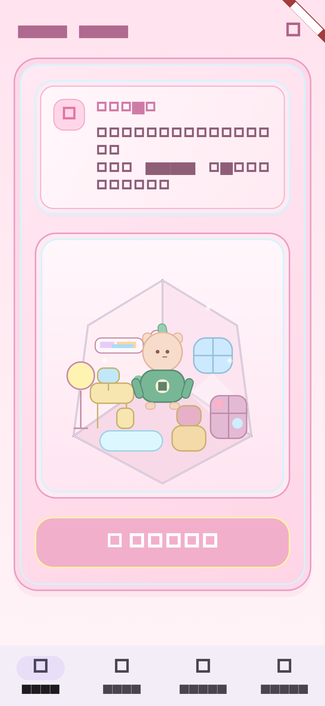
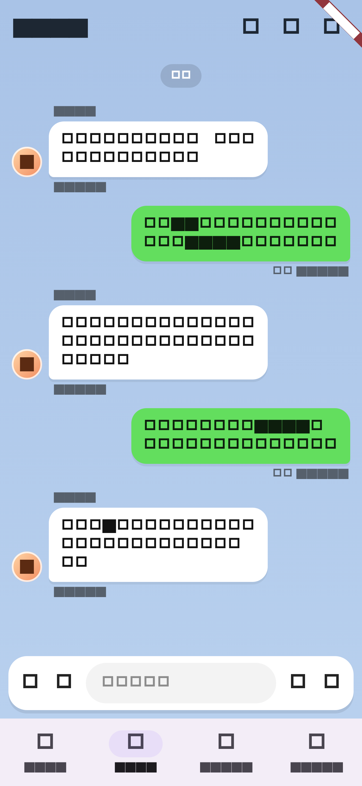
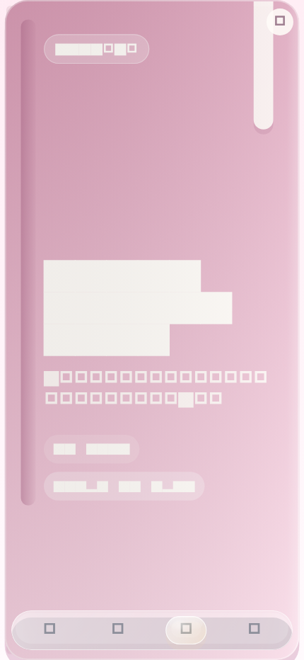
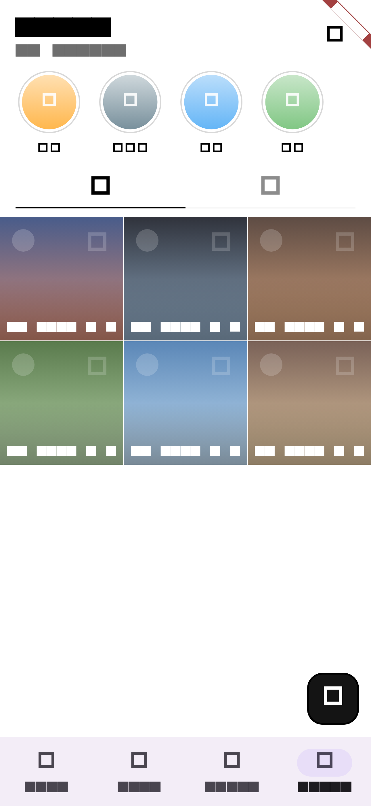

# 現状 UI プロトタイプ共有資料

## 1. 概要
今回の UI は、完成版デザインではなく、チーム内で「今どの画面がどの役割を持っているか」を共有するための現状資料です。

- 目的は `Home / chat / diary / image` の 4 タブ構成を土台として固定すること
- 画面責務と導線を先に固め、今後の AI 接続や入力実装の追加先を明確にすること
- `app / core / features` の分割を維持したまま、各 feature の見た目をプロトタイプとして育てること

現時点では、AI 応答、実通話、画像投稿、保存処理はまだつながっていません。  
あくまで「今の UI 実装がどうなっているか」を共有する資料です。

スクリーンショットは iPhone 16 Plus 相当サイズで取得しています。

## 2. 現在のタブ構成
### `Home`
- ピンク基調のホーム画面
- `今日の一言`、キャラ部屋、`話しかける` ボタンを主役にした構成
- `今日の一言` は Mori が話した内容の文字起こし表示エリアとして使う



### `chat`
- Mori との 1 対 1 会話画面
- LINE 風の左右バブル、上部検索、Home 通話ショートカットを配置
- 下部はカメラ / 画像 / メッセージ / マイク / 電話の入力バー



### `diary`
- 1ヶ月を本として扱う絵日記画面
- 月の表紙から始まり、1日1ページの絵日記を左右にめくって読む構成
- カード内の `3月17日` のような日付セレクタから表紙や任意日へジャンプできる、本文欄の右端最初の1列に `3 / 月 / 17 / 日 / 水 / 曜 / 日` のような日付を縦に置いた原稿用紙風の振り返りタブ



### `image`
- Instagram 風のギャラリー画面
- 上段に AI 分類ハイライト、下段に `AI Select` グリッドを配置
- 右下に投稿導線として丸い `+` FAB を持つ



## 3. 各画面の詳細
### Home
- `HomeQuoteCard`: `今日の一言` として Mori の文字起こしを出すカード
- `HomeRoomStage`: Mori の部屋を箱庭風に見せるメインステージ
- `話しかける` ボタン: Home 上で通話プレースホルダーを起動し、文字起こし内容を更新する

今は固定のプレースホルダー文言を差し替える形です。  
将来はここにリアルタイム文字起こし、日次ログ、キャラクター変化を足す想定です。

### chat
- `ChatMessageBubble`: ユーザー右、キャラクター左の会話バブル
- `ChatInputBar`: カメラ / 画像 / メッセージ / マイク / 電話の下部バー
- 上部と下部の電話アイコン: `Home` に戻って Mori の文字起こしを始める導線

今はダミー会話のみを表示しています。  
将来は AI 応答、送信状態、会話履歴、検索動作をここに接続する前提です。

### diary
- `DiaryScreen`: 月単位の絵日記ブックを表示する画面
- `DiaryBookViewport`: 紙のしなりと陰影を持つページめくりビュー
- `DiaryCoverPage`: 月の表紙ページ
- `DiaryDayPage`: 上段の絵エリアと、右端最初の1列に日付を縦で積んだ複数列の縦書き本文欄を持つ1日ページ
- `DiaryDaySelectorSheet`: 表紙や任意の日へ移動するためのジャンプ導線

今は `2026年3月` のダミー月データを表示しています。  
将来は保存、日付切り替え、履歴一覧、日記編集、Home / chat / image 連携を足す想定です。

### image
- `ImageHighlightRow`: `食事 / 筋トレ / 旅行 / 日常` の AI 分類ハイライト
- `ImageAiSelectGrid`: AI が選んだ写真一覧の 3 列グリッド
- `image-post-fab`: 投稿フローにつなぐ予定のプレースホルダー FAB

今は実画像やアップロード処理はなく、ダミーのビジュアルで構成しています。  
将来は投稿導線、分類結果、解析 API との接続をここに足します。

## 4. 実装構成
今回、画面ごとに責務を分けるため、構成は以下のまま維持しています。

```text
lib/
  main.dart
  app/
    app.dart
    shell/
      app_shell.dart
      app_tab.dart
      app_tab_config.dart
  core/
    theme/
      app_theme.dart
    widgets/
      section_card.dart
  features/
    home/
    chat/
    diary/
    image/
    settings/
```

### `app/`
- アプリ全体の殻
- `MaterialApp`、下部ナビ、初期タブ切り替えを持つ
- `Home` の transcript 状態や、`chat` から `Home` へ戻る電話導線の切り替えをまとめる

### `core/`
- 複数 feature で使う最小限の共有層
- 現時点ではテーマと一部共通 UI を置いている

### `features/`
- 画面単位で責務を分ける層
- `Home` は日次の入口、`chat` は会話、`diary` は振り返り、`image` は投稿整理という役割で分けている

## 5. テスト構成
UI 土台の確認は widget test で分けています。

```text
test/
  app/
    app_shell_test.dart
  features/
    home/presentation/home_screen_test.dart
    chat/presentation/chat_screen_test.dart
    diary/presentation/diary_screen_test.dart
    image/presentation/image_screen_test.dart
    settings/presentation/settings_screen_test.dart
```

### `app_shell_test.dart`
- 初回表示が `Home` であること
- 下部ナビが `Home / chat / diary / image` の 4 項目であること
- 各タブに切り替えられること
- `Home` の `話しかける` で `Home` の transcript が更新されること
- `chat` の電話導線で `Home` に戻って transcript が更新されること
- 各タブから Settings を開けること

### feature ごとの test
- `home`: transcript カード、部屋ステージ、`話しかける` が出ること
- `chat`: LINE 風の会話 UI と下部入力バーがあること
- `diary`: 月の表紙、ページめくり、カード内日付セレクタ、設定ボタンがあること
- `image`: ハイライト、AI Select、投稿 FAB があること
- `settings`: 共通設定画面の基本表示があること

## 6. 未実装・意図的にやっていないこと
今回まだ入れていないものは次のとおりです。

- Gemini / Vertex AI との接続
- 実際の通話接続、音声認識、音声入出力
- Home transcript の履歴保存やリアルタイム更新
- diary の保存、編集、日付切り替え
- 画像投稿フロー、カメラ起動、実画像表示
- メッセージ送信や画像投稿の保存処理
- 会話履歴、日次ログ、育成結果の永続化
- 本番用のデザインシステムとアセット整備

やっていない理由は、今は「どの画面がどの役割を担うか」を固める段階だからです。  
先に UI の責務と導線を揃え、その後に実処理をつなぐ順番にしています。

## 7. 次の一手
優先度順に次を進める前提です。

1. `Home` の文字起こし体験を具体化する  
   通話開始中の状態や transcript の蓄積、Mori の反応更新を詰める
2. `diary` を記録導線につなぐ  
   Home の transcript や chat / image の内容を 1 日のまとめへ反映できるようにする
3. AI / 記録連携の受け皿を決める  
   どの入力がどう保存され、キャラクター変化にどう反映するかを詰める
